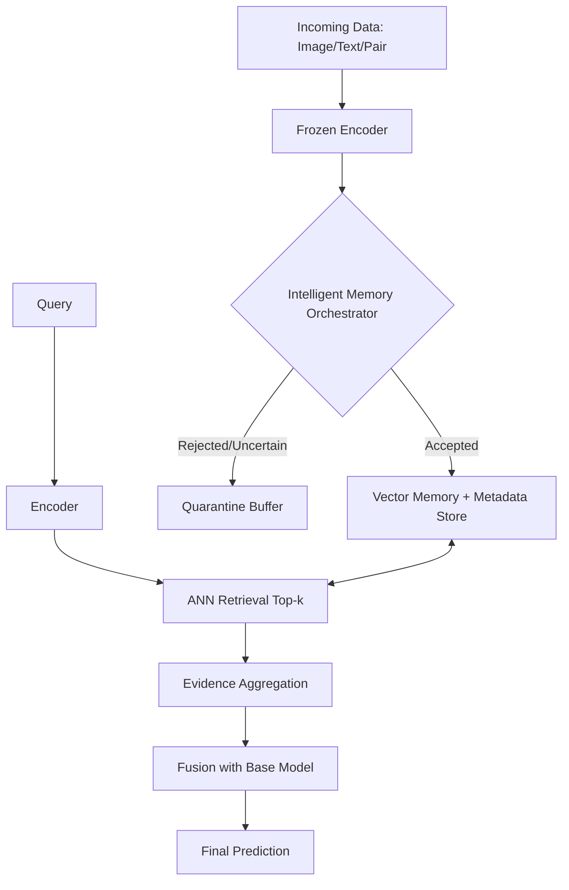

# Thesis Enrichment: Retrieval-Based Multi-Modal Framework

## Working Title
**A Retrieval-Based Multi-Modal Learning Framework for Incremental Knowledge Integration Without Model Fine-Tuning**

## Abstract (Draft)
This thesis proposes a non-parametric, retrieval-centric framework for incremental learning in multi-modal systems without updating model weights. Instead of repeatedly fine-tuning a backbone network, new knowledge is encoded into embeddings and stored in an external vector memory. A dedicated **Intelligent Memory Orchestrator (IMO)** controls memory quality using confidence gating, prototype consistency checks, and outlier filtering. During inference, the system combines base-model predictions with retrieval evidence from curated memory, enabling fast adaptation to new classes, concept drift, and domain updates under limited hardware budgets. The study evaluates performance on accuracy, latency, memory footprint, and robustness to noisy inserts, comparing against full fine-tuning and static cache baselines. The expected contribution is a practical, hardware-efficient approach that preserves stability while enabling near-real-time knowledge updates.

---

## 1) Motivation and Problem Statement
Modern multi-modal models achieve strong performance but struggle with **continuous knowledge integration**. Traditional adaptation depends on fine-tuning, which introduces three core limitations:

1. **High computational cost** (GPU memory, training time, repeated optimization cycles).
2. **Instability under sequential updates** (catastrophic forgetting and distribution drift).
3. **Low operational agility** (slow turnaround from new data arrival to deployment).

This thesis addresses the following problem:
> How can a fixed multi-modal backbone integrate new domain knowledge incrementally, with high reliability and low cost, **without** modifying its parameters?

---

## 2) Core Idea and Theoretical Position
The framework separates learning into:
- **Parametric memory** (model weights, static after pretraining),
- **Non-parametric memory** (dynamic external vector database).

Formally, let:
- $f_\theta(\cdot)$ be a frozen encoder with parameters $\theta$,
- $V=\{(z_i, y_i, t_i, q_i)\}_{i=1}^{N}$ be external memory of embeddings $z_i$, labels $y_i$, timestamps $t_i$, and quality scores $q_i$.

For an input sample $x$:
1. Compute embedding $z=f_\theta(x)$,
2. Retrieve top-$k$ neighbors from $V$ via cosine similarity,
3. Aggregate retrieval evidence into class posteriors,
4. Fuse base-model confidence and retrieval confidence for final prediction.

This design reframes adaptation from *weight optimization* to *memory management and evidence fusion*.

---

## 3) System Comparison: Fine-Tuning vs Retrieval

| Metric | Traditional Fine-Tuning (Parametric) | Proposed Retrieval Framework (Non-Parametric) |
| :--- | :--- | :--- |
| **Knowledge Storage** | Distributed in $\theta$ | Explicit memory in vector DB $V$ |
| **Update Time** | Slow (training required) | Fast (insert + index refresh) |
| **Compute Profile** | GPU-heavy (backprop) | Search-heavy (CPU/RAM + optional GPU) |
| **Forgetting Risk** | High in continual settings | Controlled via persistent memory |
| **Editability** | Hard to remove one fact | Fine-grained delete/replace per item |
| **Explainability** | Implicit in weights | Inspectable neighbors and provenance |
| **Deployment Agility** | Batch retrain cycles | Online or near-online updates |

---

## 4) Enhanced Architecture: Intelligent Memory Orchestrator (IMO)
The central novelty is the **IMO layer**, a quality gate between embedding generation and memory insertion.

### IMO Decision Pipeline
1. **Prototype consistency check**  
   Accept candidate $(z_{new}, y)$ if:
   $$
   \cos(z_{new}, P_y)\ge \tau_c
   $$
   where $P_y$ is the class prototype and $\tau_c$ is a consistency threshold.

2. **Label conflict detection**  
   If nearest neighbors strongly support labels $\neq y$, mark as uncertain and route to quarantine.

3. **Outlier detection**  
   Periodically run density-based filtering (for example, DBSCAN or Isolation Forest) to remove low-density noise points.

4. **Temporal reliability weighting**  
   Maintain reliability score:
   $$
   q_i=\alpha \cdot \text{source\_trust} + \beta \cdot e^{-\lambda\Delta t} + \gamma \cdot \text{agreement\_rate}
   $$
   for retrieval-time reweighting and pruning.

---

## 5) Retrieval and Fusion Formulation

For query embedding $z$, retrieve $k$ neighbors $\mathcal{N}_k(z)$.

Define neighbor weight:
$$
w_i=\frac{\exp(\eta \cdot \cos(z,z_i))\cdot q_i}{\sum_{j\in\mathcal{N}_k(z)} \exp(\eta \cdot \cos(z,z_j))\cdot q_j}
$$

Retrieval posterior for class $c$:
$$
p_{ret}(c|x)=\sum_{i\in\mathcal{N}_k(z)} w_i \cdot \mathbf{1}[y_i=c]
$$

Final fused posterior:
$$
p(c|x)=\lambda \, p_{base}(c|x)+(1-\lambda)\,p_{ret}(c|x)
$$
where $\lambda$ may be static or confidence-adaptive.

---

## 6) Hardware-Efficiency Argument (Stronger Form)
The framework is hardware-friendly for two structural reasons:

1. **No backpropagation in production updates**  
   New knowledge insertion requires encoding + indexing only, avoiding expensive gradient computation.

2. **Memory compression and ANN indexing**  
   Use Product Quantization (PQ) or related compression to store large-scale memory efficiently, enabling high-capacity retrieval on commodity devices.

Operationally, this shifts cost from repeated training runs to controllable indexing/search complexity.

---

## 7) Refined Research Questions and Hypotheses

### Research Questions
- **RQ1:** How does the accuracy-latency trade-off evolve as memory size scales from $10^4$ to $10^6$ entries?
- **RQ2:** To what extent does IMO improve robustness under noisy, mislabeled, or conflicting incremental updates?
- **RQ3:** Can retrieval-based adaptation match or approach fine-tuning performance on domain-shifted tasks at a fraction of computational cost?
- **RQ4:** What is the optimal fusion regime ($\lambda$, $k$, temperature $\eta$) under varying uncertainty conditions?

### Testable Hypotheses
- **H1:** IMO-enabled retrieval significantly outperforms naive cache insertion under injected label noise.
- **H2:** Retrieval adaptation achieves competitive accuracy with substantially lower update-time compute than full fine-tuning.
- **H3:** Confidence-aware fusion reduces failure cases in out-of-distribution or drifted samples.

---

## 8) Experimental Design Blueprint

### Baselines
- Frozen backbone only (no retrieval).
- Fine-tuned backbone (periodic retraining).
- Static retrieval cache without quality control.
- Proposed retrieval + IMO + fusion.

### Evaluation Axes
- **Effectiveness:** top-1/top-5 accuracy, macro-F1, calibration error.
- **Efficiency:** insertion latency, query latency (p50/p95), memory usage.
- **Robustness:** performance under synthetic and real noise, drift, and class imbalance.
- **Continual behavior:** performance retention across sequential updates.

### Suggested Ablations
- Remove IMO entirely.
- Disable prototype check, conflict check, or outlier module one at a time.
- Replace confidence-aware weighting with uniform neighbor weighting.
- Compare different ANN settings and quantization levels.

---

## 9) Threats to Validity and Mitigation
- **Embedding bias from frozen encoder**  
  Mitigation: evaluate multiple encoders (for example, CLIP-family and MobileNetV2-based variants).
- **Memory contamination risk**  
  Mitigation: quarantine + scheduled pruning + provenance metadata.
- **Domain-specific overfitting in retrieval memory**  
  Mitigation: cross-domain validation and controlled memory balancing.
- **Latency degradation at scale**  
  Mitigation: ANN tuning, memory compaction, and tiered storage.

---

## 10) Expected Contributions
1. A formalized retrieval-based continual learning framework for multi-modal settings without parameter updates.
2. The **Intelligent Memory Orchestrator** as a quality-control mechanism for robust incremental memory growth.
3. A reproducible empirical study across accuracy, efficiency, and robustness dimensions.
4. Practical deployment guidance for low-resource environments where fine-tuning is operationally expensive.

---

## 11) Practical Note for Your Current Implementation
If your practical setup uses **MobileNetV2**, define it clearly as the **frozen parametric backbone**, while the vector database acts as **dynamic non-parametric memory**. This explicit separation strengthens your theoretical framing and aligns your implementation with your thesis claim.
